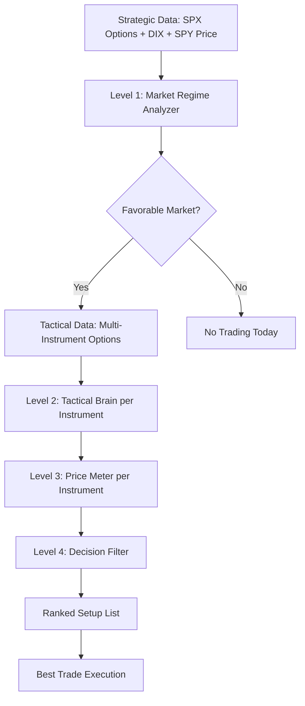

# 📊 GVEX Horizon Strategy

**Концептуальный Документ v1.2 (Final)**

---

## 🚀 QuantFlow Web Application

### Live Demo
**QuantFlow v5.3** - Interactive Options Analytics Dashboard is now deployed on GitHub Pages!

### Features
- 📊 **Multi-Horizon Gamma Analysis** - Analyze Short/Mid/Long-DTE exposure
- 📈 **Interactive Charts** - Plotly-powered visualization with zoom & pan
- 🎯 **Market Regime Detection** - DIX-based institutional flow analysis  
- 🔄 **Real-time Calculations** - Client-side processing with Black-Scholes Greeks
- 📁 **CSV Import** - Support for CBOE SPX options chains + DIX data
- 💾 **Demo Mode** - Load synthetic data for testing

### Quick Start
1. **Load Demo Data** - Click "LOAD DEMO DATA" button to see example analysis
2. **Upload Your Data** - Import CBOE SPX options CSV and DIX CSV files
3. **Analyze** - Click "INITIALIZE MODEL" to run calculations
4. **Explore** - Navigate between Horizon Analysis, Greeks Profile, and Data Matrix tabs

### Local Development
```bash
# Clone the repository
git clone <your-repo-url>
cd <repo-name>

# Open in browser (no build step required - pure HTML/JS)
open index.html
# or use a local server:
python -m http.server 8000
# Then visit http://localhost:8000
```

### Data Format
**SPX Options CSV** (CBOE format):
- Must contain columns: Strike, Gamma (calls & puts), Open Interest, IV, Expiration Date
- Supports Russian date formats (e.g., "21 ноября 2025 г.")

**DIX CSV** (Squeezemetrics format):
- Must contain columns: Date, DIX, Price
- Historical data recommended (60+ days for dynamic thresholds)

---

## 📋 Метаданные

| Параметр | Значение |
|----------|----------|
| **Полное название** | Gamma-Vanna Exposure Horizon |
| **Короткая форма** | GVEXH |
| **Версия** | 1.2 |
| **Платформа** | Archon |
| **Инструменты** | SPX 0DTE опционы, ETF/акции 14-21 DTE |
| **Тип стратегий** | Кредитные пут-спреды |

### 💡 Слоган
> *"Multi-Horizon Analysis. Multi-Greek Intelligence. Multi-Instrument Opportunities."*

---

## 🎯 Executive Summary

### Что это

Система анализа опционных экспозиций дилеров **(Gamma + Vanna)**, сегментированных по временным горизонтам (0-5, 6-30, >30 DTE) для определения рыночных режимов и структурных уровней.

### Двухслойная Организация Данных

```
┌─────────────────────────────────────────────┐
│ STRATEGIC DATA LAYER (SPX Only)             │
│ → Market-wide context analysis              │
│ → Sources: CBOE SPX, DIX, MT5 SPY           │
│ → Feeds: Level 1                            │
└─────────────────────────────────────────────┘
                    ↓
        Market Context Determined
                    ↓
┌─────────────────────────────────────────────┐
│ TACTICAL DATA LAYER (Multi-Instrument)      │
│ → Instrument-specific opportunities         │
│ → Sources: Yahoo Finance / IBKR             │
│ → Feeds: Level 2-4                          │
│ → Instruments: SPY, AAPL, QQQ, MSFT, etc.   │
└─────────────────────────────────────────────┘
```

### Четырехуровневая Архитектура Анализа



### Уникальность

| Традиционный GEX | GVEX Horizon |
|------------------|--------------|
| "Поддержка на 4500" | "SPX: Deep Liquidity (95%), Vol: NORMAL → Scan multi-instrument → AAPL: Support 180 (сила 3), Vanna reinforcing, Signal LONG → Агрессивный пут-спред" |

### Задача

Статистически повысить вероятность успешных сделок в кредитных пут-спредах через:

- ✅ Определение благоприятных MARKET-WIDE режимов (SPX Strategic Layer → Level 1)
- ✅ Поиск лучших INSTRUMENT-SPECIFIC сетапов (Tactical Layer → Level 2-4)
- ✅ Своевременный выход при смене обстановки
- ✅ Контроль рисков через Hybrid Vol Regime + Vanna effects

---

## 🧠 Глава 1: Философия

### Фундаментальная Идея

> Потоки хеджирования маркет-мейкеров создают **Implied Order Book** - скрытую структуру лимитных ордеров. Опционная книга дилеров проявляется через вынужденное хеджирование, создавая предсказуемые паттерны.

### Ключевые Принципы

1. **Иерархия** — 4 уровня анализа последовательно обрабатывают информацию от макро-контекста до конкретного торгового сигнала
2. **Двухслойная организация данных** — Strategic layer (SPX market context) определяет Tactical layer (multi-instrument opportunities)
3. **Контекст** — Одни и те же GEX/VEX значения интерпретируются по-разному в разных режимах
4. **Адаптивность** — Параметры анализа меняются под текущий рыночный режим
5. **Управление риском** — Hybrid vol approach: critical veto на стратегическом уровне + gradual adjustment на тактическом

---

### Три Столпа GVEX Horizon

#### 1️⃣ Multi-Greek Analysis

| Традиционный GEX | GVEX Horizon |
|------------------|--------------|
| Только Gamma | Gamma + Vanna + Charm |

> 🔥 **Критический инсайт**: *"Eventually, the effect of vanna overwhelms the effect of gamma"*

В режимах **Reflexive Rally Risk** и **Fragile Instability** Vanna становится доминирующим фактором.

#### 2️⃣ Horizon-Based Segmentation

| Горизонт | DTE | Назначение |
|----------|-----|------------|
| **Short Horizon** | 0-5 DTE | Тактика, 0DTE эффекты, внутридневные каскады |
| **Mid Horizon** | 6-30 DTE | Структурные уровни, недельная поддержка/сопротивление |
| **Long Horizon** | >30 DTE | Стратегический контекст, долгосрочная "плавучесть" |

#### 3️⃣ Multi-Layer Architecture

**4-Level Analysis Pipeline:**
- Level 1: Strategic Market Regime (SPX context)
- Level 2: Tactical Brain (per-instrument)
- Level 3: Price Meter (per-instrument)
- Level 4: Decision Filter (final signal)

**2-Layer Data Organization:**
- Strategic Data Layer (SPX для market context)
- Tactical Data Layer (Multi-instrument для opportunities)

---

## 🏗️ Глава 2: Архитектура Системы

### Общая Схема

```
┌──────────────────────────────────────────────────────────┐
│ STRATEGIC DATA LAYER                                     │
│ ┌──────────────┬──────────────┬──────────────┐           │
│ │ CBOE SPX CSV │ DIX CSV squeezemetrics│ MT5(IB) SPX(SPY) Bars   │
│ │ (Full chain) │ (Daily)      │ (5-min)      │           │
│ └──────────────┴──────────────┴──────────────┘           │
└────────────────┬─────────────────────────────────────────┘
                 ↓
┌────────────────────────────────────────────────────────────┐
│ LEVEL 1: MARKET REGIME ANALYZER                            │
│ ────────────────────────────────────────────────────────── │
│ Задача: Определить market-wide режим (SPX context)         │
│                                                            │
│ Расчеты:                                                   │
│ • GEX/VEX по horizons (Short/Mid/Long)                     │
│ • HAR-RV → Vol Regime (SPIKE/ELEVATED/NORMAL/COMPRESSED)   │
│ • Dynamic Thresholds (60d percentiles, fallback static)    │
│ • Market Regime Classification (5 типов)                   │
│                                                            │
│ Выход:                                                     │
│ • Market_Regime (Deep Liquidity, Instability, etc.)        │
│ • Vol_Regime (для hybrid vol approach)                     │
│ • Confidence (95%, 80%, etc.)                              │
│ • Put_Spread_Favorable (True/False)                        │
│                                                            │
│ ⚠️ CRITICAL VOL VETO: Vol SPIKE → Trading SUSPENDED       │
└────────────────┬───────────────────────────────────────────┘
                 ↓
        IF put_spread_favorable == True
                 ↓
┌──────────────────────────────────────────────────────────┐
│ TACTICAL DATA LAYER                                      │
│ ┌──────────────────────────────────────────────┐        │
│ │ CBOE (IBKR API / Poligon)                    │        │
│ │ Options chains for:                          │        │
│ │ SPY, AAPL, QQQ, MSFT, NVDA, TSLA, etc.       │        │
│ └──────────────────────────────────────────────┘        │
└────────────────┬─────────────────────────────────────────┘
                 ↓
        FOR EACH instrument IN watchlist
                 ↓
┌────────────────────────────────────────────────────────────┐
│ LEVEL 2: TACTICAL BRAIN (per instrument)                  │
│ ────────────────────────────────────────────────────────── │
│ Задача: Найти конкретные сетапы в инструменте             │
│                                                            │
│ Входы:                                                     │
│ • Strategic Context (Market_Regime, Vol_Regime от L1)      │
│ • Instrument Options Chain                                 │
│ • Current Price                                            │
│                                                            │
│ Расчеты:                                                   │
│ • GEX/VEX для инструмента (dealer positioning + weights)   │
│ • Key Levels (Support/Resistance, strength 1-3)            │
│ • Gamma Flip                                               │
│ • Vanna Flow по страйкам                                   │
│ • Risk Policy (с учетом Vol_Regime от L1)                  │
│                                                            │
│ Выход:                                                     │
│ • Tactical Config (entry rules, sizing, stops)             │
│ • Key Levels (support/resistance)                          │
│                                                            │
│ 📊 GRADUAL VOL ADJUSTMENT:                                │
│    Vol ELEVATED → position_size × 0.5                      │
└────────────────┬───────────────────────────────────────────┘
                 ↓
┌────────────────────────────────────────────────────────────┐
│ LEVEL 3: ADAPTIVE PRICE METER (per instrument)            │
│ ────────────────────────────────────────────────────────── │
│ Задача: Оценить ценовую динамику инструмента              │
│                                                            │
│ Входы:                                                     │
│ • Price History                                            │
│ • Vol_Regime (от L1)                                       │
│                                                            │
│ Процесс:                                                   │
│ 1. Kalman Filtering (vol-adaptive, real-time)              │
│ 2. Vol-Adaptive Normalization (НЕ regime-dependent!)       │
│                                                            │
│ Выход:                                                     │
│ • avgZ_clean (normalized price oscillator)                 │
│                                                            │
│ 💡 Vol-Adaptive: Kalman parameters зависят от vol_regime  │
│    Lookback зависит от rv_1d/rv_22d                        │
└────────────────┬───────────────────────────────────────────┘
                 ↓
┌────────────────────────────────────────────────────────────┐
│ LEVEL 4: DECISION FILTER (per instrument)                 │
│ ────────────────────────────────────────────────────────── │
│ Задача: Финальное решение на основе синтеза L1+L2+L3      │
│                                                            │
│ Входы:                                                     │
│ • avgZ_clean (от L3)                                       │
│ • Strategic Context (от L1)                                │
│ • Tactical Config (от L2)                                  │
│                                                            │
│ Три Гейта:                                                 │
│ 1. Context Gate: Режим позволяет торговать?               │
│ 2. Significance Gate: Сигнал достаточно сильный?          │
│ 3. Risk Policy Gate: Соответствует risk rules?            │
│                                                            │
│ Выход:                                                     │
│ • LONG / SHORT / NEUTRAL                                   │
│                                                            │
│ 🎯 Confidence-Based Thresholds:                           │
│    Высокий confidence → низкий threshold                   │
└────────────────┬───────────────────────────────────────────┘
                 ↓
        Calculate Setup Score
                 ↓
        Rank All Instruments
                 ↓
        BEST SETUP → EXECUTION
```

---

## 📊 Глава 3: Level 1 - Strategic Market Regime Analyzer

### Задача

Определить market-wide режим на основе **SPX опционной структуры**. Ответить на вопрос: **"Можно ли торговать сегодня?"**

### Источники Данных (Strategic Layer)

| Источник | Инструмент | Данные | Частота | Оценка |
|----------|------------|--------|---------|--------|
| **CBOE** | SPX | Полная опционная цепочка (CSV) | EOD + опц. intraday | ⭐⭐⭐ |
| **Squeezemetrics** | - | DIX, GEX aggregates | EOD (18:00 ET) | ⭐⭐⭐ |
| **MT5** | SPY | 5-min bars для HAR-RV | Real-time | ⭐⭐⭐ |

### Входные Метрики

```python
# ══════════════════════════════════════════════════════════
# ОСНОВНЫЕ МЕТРИКИ (из SPX опционов CBOE)
# ══════════════════════════════════════════════════════════

# GEX по горизонтам (нормализованные)
GEX_norm_short = GEX_abs_short / (Total_OI_short × SPX_Price)
GEX_norm_mid = GEX_abs_mid / (Total_OI_mid × SPX_Price)
GEX_norm_long = GEX_abs_long / (Total_OI_long × SPX_Price)

# VEX по горизонтам (нормализованные)
VEX_norm_short = VEX_abs_short / (Total_OI_short × SPX_Price)
VEX_norm_mid = VEX_abs_mid / (Total_OI_mid × SPX_Price)

# Институциональные потоки
DIX_smooth = 3-day EMA of DIX

# ══════════════════════════════════════════════════════════
# HAR-RV МОДЕЛЬ (из SPY price через MT5)
# ══════════════════════════════════════════════════════════

rv_1d, rv_5d, rv_22d = calculate_har_rv(spy_5min_bars)
vol_regime = classify_vol_regime(rv_1d, rv_22d)
```

### HAR-RV Расчет

```python
def calculate_har_rv(spy_5min_bars):
    """
    Heterogeneous AutoRegressive Realized Volatility
    
    Использует SPY как proxy для SPX (correlation 0.99+)
    Multi-horizon nature согласуется с DTE segmentation философией
    """
    # Resample 5-min bars to daily
    daily_returns = resample_to_daily(spy_5min_bars)
    
    # Daily RV (annualized)
    rv_daily = np.sqrt(252) * daily_returns[-1:].std()
    
    # Weekly RV (average of last 5 days)
    rv_weekly = np.mean([
        daily_returns[-i:].std() * np.sqrt(252) 
        for i in range(1, 6)
    ])
    
    # Monthly RV (last 22 days)
    rv_monthly = daily_returns[-22:].std() * np.sqrt(252)
    
    return rv_daily, rv_weekly, rv_monthly

def classify_vol_regime(rv_1d, rv_22d):
    """
    Классификация volatility regime
    
    HYBRID APPROACH:
    - SPIKE (>1.5x): Critical veto на Level 1
    - ELEVATED (1.2-1.5x): Warning, size reduction на Level 2
    - NORMAL (0.7-1.2x): Standard operations
    - COMPRESSED (<0.7x): Ideal для premium selling
    """
    vol_ratio = rv_1d / rv_22d
    
    if vol_ratio > 1.5:
        return "SPIKE"
    elif vol_ratio > 1.2:
        return "ELEVATED"
    elif vol_ratio < 0.7:
        return "COMPRESSED"
    else:
        return "NORMAL"
```

### Hybrid Vol Approach (КЛЮЧЕВОЕ УЛУЧШЕНИЕ v1.2)

```python
def analyze_market_regime(gex, vex, dix, vol_regime):
    """
    Market Regime Classification с Hybrid Vol Approach
    
    АРХИТЕКТУРА:
    ════════════════════════════════════════════════════════
    Level 1: Critical Vol Spike VETO
             Системный риск → полная остановка торговли
    
    Level 2: Gradual Vol Adjustment  
             Elevated vol → tactical size reduction
    ════════════════════════════════════════════════════════
    """
    
    # ════════════════════════════════════════════════════════
    # CRITICAL VOL VETO (Level 1 Strategic)
    # ════════════════════════════════════════════════════════
    if vol_regime == "SPIKE":
        # Premium selling очень опасен при vol spike
        # Полная остановка торговли
        return {
            'regime': "TRADING SUSPENDED",
            'confidence': 0,
            'put_spread_favorable': False,
            'reason': 'Vol spike override - системный риск',
            'vol_regime': vol_regime,
            'trade_bias': 'NONE'
        }
    
    # ════════════════════════════════════════════════════════
    # БАЗОВАЯ КЛАССИФИКАЦИЯ РЕЖИМА (GEX/VEX/DIX)
    # ════════════════════════════════════════════════════════
    base_regime = classify_base_regime(gex, vex, dix)
    base_confidence = get_base_confidence(base_regime)
    
    # ════════════════════════════════════════════════════════
    # VOL CONTEXT ADJUSTMENT (если elevated)
    # ════════════════════════════════════════════════════════
    if vol_regime == "ELEVATED":
        # Режим сохраняется, но снижаем confidence
        # Передаем warning на Level 2 для size reduction
        confidence = max(base_confidence - 10, 70)
    else:
        confidence = base_confidence
    
    return {
        'regime': base_regime,
        'confidence': confidence,
        'put_spread_favorable': True,
        'vol_regime': vol_regime,  # Передаем на Level 2!
        'trade_bias': get_trade_bias(base_regime)
    }
```

> 💡 **Ключевое преимущество:** Vol spike (>1.5x) = стратегический veto. Elevated vol (1.2-1.5x) = тактическая корректировка.

### Dynamic Thresholds с Bootstrap

```python
def calculate_dynamic_thresholds(gex_history_60d, vex_history_60d, dix_history_60d):
    """
    Adaptive thresholds с fallback для cold start
    
    ПЕРВЫЕ 60 ДНЕЙ: Static fallback (эмпирические значения)
    ПОСЛЕ 60 ДНЕЙ: Dynamic percentile-based
    """
    
    # ════════════════════════════════════════════════════════
    # FALLBACK ДЛЯ BOOTSTRAP ПЕРИОДА
    # ════════════════════════════════════════════════════════
    if len(gex_history_60d) < 60:
        return {
            'gex_positive_strong': +0.20,
            'gex_negative_strong': -0.15,
            'vex_positive': +0.05,
            'vex_negative_strong': -0.10,
            'dix_bullish': 43.0,
            'dix_bearish': 42.0,
            'source': 'static_fallback'
        }
    
    # ════════════════════════════════════════════════════════
    # DYNAMIC ПОСЛЕ НАКОПЛЕНИЯ ДАННЫХ
    # ════════════════════════════════════════════════════════
    thresholds = {
        # GEX thresholds (percentile-based)
        'gex_positive_strong': np.percentile(gex_history_60d['mid'], 75),
        'gex_negative_strong': np.percentile(gex_history_60d['short'], 25),
        
        # VEX thresholds
        'vex_positive': np.percentile(vex_history_60d['short'], 60),
        'vex_negative_strong': np.percentile(vex_history_60d['short'], 20),
        
        # DIX thresholds
        'dix_bullish': np.percentile(dix_history_60d, 65),
        'dix_bearish': np.percentile(dix_history_60d, 35),
        
        'source': 'dynamic_60d'
    }
    
    return thresholds
```

### Матрица Рыночных Режимов

#### ✅ Режим 1: Deep Liquidity

```python
if (GEX_norm_mid > THRESHOLDS['gex_positive_strong'] and 
    GEX_norm_long > THRESHOLDS['gex_positive_strong'] * 0.75 and
    VEX_norm_short >= 0 and
    VEX_norm_mid >= 0 and
    DIX_smooth > THRESHOLDS['dix_bullish'] and
    vol_regime in ["COMPRESSED", "NORMAL"]):
    
    regime = "Deep Liquidity"
    confidence = 95
    trade_bias = "LONG"
    put_spread_favorable = True
```

**Интерпретация:**
- ✅ Структурная поддержка сильна (Mid + Long horizons положительны)
- ✅ Vanna не создает негативных эффектов
- ✅ Институционалы накапливают (DIX высокий)
- ✅ Волатильность низкая/нормальная

**Торговое действие:** Сканировать watchlist для агрессивных пут-спредов

---

#### ⚠️ Режим 2: Fragile Instability

```python
if (GEX_norm_short < THRESHOLDS['gex_negative_strong'] and 
    VEX_norm_short < THRESHOLDS['vex_negative_strong'] and
    DIX_smooth < THRESHOLDS['dix_bearish']):
    
    regime = "Fragile Instability"
    confidence = 100
    trade_bias = "SHORT"
    put_spread_favorable = False
    exit_all_long_positions = True
    
    if vol_regime == "SPIKE":
        urgency = "CRITICAL"
```

> 🚨 **Критический инсайт:** "Идеальный шторм 0DTE" - отрицательная Short Horizon Gamma + отрицательная Short Horizon Vanna усиливают падение.

**Торговое действие:**
- 🛑 ЗАПРЕТ на пут-спреды
- 🚪 Немедленный выход из всех лонговых позиций

---

#### 🎪 Режим 3: Reflexive Rally Risk

```python
if (GEX_norm_short > 0 and 
    VEX_norm_short < THRESHOLDS['vex_negative_strong']):
    
    regime = "Reflexive Rally Risk"
    confidence = 85
    trade_bias = "NEUTRAL_PRE_EVENT"
    put_spread_favorable = False
    prepare_long_post_event = True
```

**Ключевой механизм:**
> 🪃 "Сжатая пружина" - положительная Gamma стабилизирует, но отрицательная Vanna создает риск резкого ралли при падении IV (после FOMC, CPI, NFP).

**Торговое действие:**
- ⏸️ Воздержаться ПЕРЕД событиями
- 🎯 Готовиться к входу ПОСЛЕ снятия пика волатильности

---

#### 📉 Режим 4: Structural Weakness

```python
if (GEX_norm_mid < 0):
    regime = "Structural Weakness"
    confidence = 80
    trade_bias = "CAUTIOUS"
    put_spread_favorable = "SELECTIVE"
    position_size_reduction = 0.5
    
    if vol_regime == "ELEVATED":
        position_size_reduction = 0.25
```

**Торговое действие:**
- ⚡ Пут-спреды ТОЛЬКО у сильнейших уровней (strength 3)
- 📊 Размер позиции 50% (25% если vol elevated)

---

#### 🌀 Режим 5: Contradictory / Chop

```python
if signals_contradictory(GEX_short, GEX_mid, GEX_long, DIX):
    regime = "Chop"
    confidence = 40
    trade_bias = "NEUTRAL"
    put_spread_favorable = False
    no_new_positions = True
```

**Торговое действие:**
- 🚫 Вне рынка
- 🏃 Закрыть существующие позиции

---

## 📊 Глава 4: Levels 2-4 - Tactical Multi-Instrument Analysis

### Источники Данных (Tactical Layer)

| Источник | Инструменты | Данные | Метод | Оценка |
|----------|-------------|--------|-------|--------|
| **CBOE** | SPY, AAPL, QQQ, MSFT, NVDA, TSLA | Options chains | ⭐⭐ Доступно бесплатно и просто для старта |
| **IBKR API** | Все ликвидные | Options chains | TWS API | ⭐⭐⭐ Production |
| **Polygon.io** | Все | Real-time options | API ($200/mo) | 🔮 Будущее |

**Рекомендация:** Старт с CBOE, переход на IBKR если торговать придется через них. На Polygon при успехе.

### Tactical Workflow

```python
# ════════════════════════════════════════════════════════
# MORNING: STRATEGIC ANALYSIS (1x в день, 09:30 ET)
# ════════════════════════════════════════════════════════

strategic_context = run_level_1_analysis()
# Returns: {
#   'regime': 'Deep Liquidity',
#   'confidence': 95,
#   'vol_regime': 'NORMAL',
#   'put_spread_favorable': True
# }

if not strategic_context['put_spread_favorable']:
    print("⛔ Market unfavorable - NO TRADING TODAY")
    exit()

print(f"✅ Market Context: {strategic_context['regime']}")
print(f"✅ Vol Regime: {strategic_context['vol_regime']}")
print("→ Proceeding to tactical scan...")

# ════════════════════════════════════════════════════════
# INTRADAY: TACTICAL SCAN (каждые 30-60 min)
# ════════════════════════════════════════════════════════

WATCHLIST = ['SPY', 'AAPL', 'QQQ', 'MSFT', 'NVDA', 'TSLA', 'AMZN']
candidates = []

for symbol in WATCHLIST:
    print(f"\n📊 Analyzing {symbol}...")
    
    # Get instrument data
    options_chain = get_options_chain(symbol)  # Yahoo Finance / IBKR
    current_price = get_current_price(symbol)
    
    # ═══════════════════════════════════════════════════
    # LEVEL 2: TACTICAL BRAIN
    # ═══════════════════════════════════════════════════
    tactical = run_level_2_analysis(
        symbol=symbol,
        options_chain=options_chain,
        current_price=current_price,
        strategic_context=strategic_context  # Context от L1!
    )
    # Returns: {
    #   'key_levels': {...},
    #   'gamma_flip': 176,
    #   'risk_policy': {...},
    #   'entry_favorable': True/False
    # }
    
    if not tactical['entry_favorable']:
        print(f"  ❌ No setup - {tactical['skip_reason']}")
        continue
    
    # ═══════════════════════════════════════════════════
    # LEVEL 3: PRICE METER
    # ═══════════════════════════════════════════════════
    price_signal = run_level_3_analysis(
        symbol=symbol,
        vol_regime=strategic_context['vol_regime'],
        rv_1d=strategic_context['rv_1d'],
        rv_22d=strategic_context['rv_22d']
    )
    # Returns: avgZ_clean
    
    # ═══════════════════════════════════════════════════
    # LEVEL 4: DECISION FILTER
    # ═══════════════════════════════════════════════════
    decision = run_level_4_filter(
        avgZ_clean=price_signal,
        strategic_context=strategic_context,
        tactical_config=tactical
    )
    # Returns: 'LONG' / 'SHORT' / 'NEUTRAL'
    
    if decision != "LONG":
        print(f"  ❌ Signal: {decision}")
        continue
    
    # ═══════════════════════════════════════════════════
    # SETUP SCORING & RANKING
    # ═══════════════════════════════════════════════════
    setup_score = calculate_setup_score(
        support_strength=tactical['key_levels']['support_strength'],
        vanna_flow=tactical['vanna_flow'],
        price_distance=abs(current_price - tactical['key_levels']['support']) / current_price,
        signal_strength=abs(price_signal),
        confidence=strategic_context['confidence']
    )
    
    print(f"  ✅ Entry Candidate (score: {setup_score:.2f})")
    
    candidates.append({
        'symbol': symbol,
        'setup_score': setup_score,
        'tactical': tactical,
        'price_signal': price_signal,
        'decision': decision
    })

# ════════════════════════════════════════════════════════
# RANK & SELECT BEST SETUP
# ════════════════════════════════════════════════════════

if len(candidates) == 0:
    print("\n📭 No setups found")
else:
    candidates_ranked = sorted(candidates, key=lambda x: x['setup_score'], reverse=True)
    best = candidates_ranked[0]
    
    print(f"\n🏆 BEST SETUP: {best['symbol']} (score: {best['setup_score']:.2f})")
    print(f"   → Consider entering put spread")
```

---

### Level 2: Tactical Brain (Per-Instrument)

**Задача:** Найти конкретные entry points в инструменте на основе Strategic Context

#### Входные Данные

- **Strategic Context** (от Level 1):
  - Market_Regime
  - Vol_Regime
  - Confidence
  
- **Instrument-Specific**:
  - Options Chain (Yahoo Finance / IBKR)
  - Current Price
  - Price History

#### Улучшенный Расчет GEX (с Dealer Positioning)

```python
def calculate_dealer_gex(options_chain, spot, horizon):
    """
    GEX с учетом:
    1. Dealer positioning assumption (short calls, long puts)
    2. Moneyness weighting (ATM имеет больший вес)
    
    ВАЖНО: Формула одинакова для SPX (L1) и других инструментов (L2)
    Разница только в threshold для классификации силы уровня
    """
    total_gex = 0
    
    for option in options_chain:
        if option.dte not in horizon_range:
            continue
        
        # Greeks calculation (Black-Scholes с IV из данных)
        gamma = calculate_gamma(
            spot=spot,
            strike=option.strike,
            dte=option.dte,
            iv=option.iv,
            rate=0.05
        )
        
        # ═══════════════════════════════════════════════════
        # DEALER POSITIONING ASSUMPTION
        # ═══════════════════════════════════════════════════
        if option.type == 'call':
            dealer_multiplier = -1  # Dealers обычно SHORT calls
        else:
            dealer_multiplier = +1  # Dealers обычно LONG puts
        
        # ═══════════════════════════════════════════════════
        # MONEYNESS WEIGHTING
        # ═══════════════════════════════════════════════════
        moneyness = spot / option.strike
        
        if 0.98 <= moneyness <= 1.02:  # ATM
            weight = 2.0
        elif 0.95 <= moneyness <= 1.05:  # Near money
            weight = 1.0
        else:  # Deep OTM/ITM
            weight = 0.5
        
        # ═══════════════════════════════════════════════════
        # GEX CONTRIBUTION
        # ═══════════════════════════════════════════════════
        gex_contribution = (
            gamma * 
            dealer_multiplier * 
            option.oi * 
            100 * 
            spot * spot * 
            weight
        )
        
        total_gex += gex_contribution
    
    return total_gex
```

> 💡 **Ключевое улучшение:** GEX теперь отражает реальное hedging давление дилеров, а не просто абстрактную гамму.

#### Vol-Based Risk Adjustment (Level 2)

```python
def tactical_brain(symbol, options_chain, current_price, strategic_context):
    """
    Tactical analysis с учетом Strategic Context
    
    HYBRID VOL APPROACH (Level 2):
    ════════════════════════════════════════════════════════
    Gradual adjustment на основе vol_regime от Level 1
    """
    # Базовая политика от market regime
    base_policy = get_base_policy(strategic_context['regime'])
    
    # ════════════════════════════════════════════════════════
    # GRADUAL VOL ADJUSTMENT (Level 2 Tactical)
    # ════════════════════════════════════════════════════════
    vol_regime = strategic_context['vol_regime']
    
    if vol_regime == "ELEVATED":
        # Уменьшить размер, расширить спреды
        base_policy['position_size'] *= 0.5
        base_policy['spread_width'] *= 1.2
        base_policy['profit_target'] = 0.30  # Раньше закрываем
        
    elif vol_regime == "COMPRESSED":
        # Ideal conditions
        base_policy['position_size'] *= 1.0
        base_policy['profit_target'] = 0.50
    
    # ════════════════════════════════════════════════════════
    # KEY LEVELS ANALYSIS
    # ════════════════════════════════════════════════════════
    key_levels = find_key_levels(options_chain, current_price, symbol)
    gamma_flip = find_gamma_flip(options_chain, current_price)
    vanna_flow = calculate_vanna_flow_at_support(
        options_chain, 
        key_levels['nearest_support']
    )
    
    # ════════════════════════════════════════════════════════
    # ENTRY CONDITIONS CHECK
    # ════════════════════════════════════════════════════════
    entry_favorable = check_entry_conditions(
        current_price=current_price,
        support=key_levels['nearest_support'],
        support_strength=key_levels['support_strength'],
        gamma_flip=gamma_flip,
        vanna_flow=vanna_flow,
        regime=strategic_context['regime']
    )
    
    return {
        'risk_policy': base_policy,
        'key_levels': key_levels,
        'gamma_flip': gamma_flip,
        'vanna_flow': vanna_flow,
        'entry_favorable': entry_favorable,
        'skip_reason': get_skip_reason(...) if not entry_favorable else None
    }
```

#### Расчет Силы Уровня

```python
def calculate_level_strength(strike, horizon, options_chain, symbol):
    """
    Сила уровня от 1 (слабый) до 3 (сильный)
    
    АДАПТАЦИЯ ПО ИНСТРУМЕНТУ:
    Threshold зависит от капитализации/ликвидности
    """
    gex_at_strike = get_gex(strike, horizon, options_chain)
    vanna_flow = get_vanna_flow(strike, options_chain)
    
    # ════════════════════════════════════════════════════════
    # INSTRUMENT-SPECIFIC THRESHOLDS
    # ════════════════════════════════════════════════════════
    thresholds = get_thresholds_for_symbol(symbol)
    # Примеры:
    # SPY: strong = $2B, medium = $1B
    # AAPL: strong = $500M, medium = $250M (меньше ликвидность)
    # QQQ: strong = $1.5B, medium = $750M
    
    if gex_at_strike > thresholds['strong']:
        base_strength = 3
    elif gex_at_strike > thresholds['medium']:
        base_strength = 2
    else:
        base_strength = 1
    
    # Модификаторы
    if vanna_flow > 0:  # Vanna reinforcing
        base_strength += 0.5
    
    return min(3, max(1, round(base_strength)))
```

---

### Level 3: Adaptive Price Meter

**Задача:** Оценить ценовую динамику инструмента

```python
def run_level_3_analysis(symbol, vol_regime, rv_1d, rv_22d):
    """
    Price oscillator с Kalman filtering и vol-adaptive normalization
    
    ПРЕИМУЩЕСТВА KALMAN:
    - Real-time без boundary effects
    - Vol-adaptive noise parameters
    - Согласуется с философией vol-adaptive системы
    """
    # Get price history
    price_history = get_price_history(symbol, bars=200)
    
    # ════════════════════════════════════════════════════════
    # KALMAN FILTERING (Vol-Adaptive)
    # ════════════════════════════════════════════════════════
    clean_price = kalman_filter_vol_adaptive(
        price_history, 
        vol_regime,
        rv_1d,
        rv_22d
    )
    
    # ════════════════════════════════════════════════════════
    # VOL-ADAPTIVE NORMALIZATION
    # КРИТИЧНО: Зависит от VOL RATIO, НЕ от market regime!
    # ════════════════════════════════════════════════════════
    avgZ_clean = vol_adaptive_normalize(clean_price, rv_1d, rv_22d)
    
    return avgZ_clean


def kalman_filter_vol_adaptive(prices, vol_regime, rv_1d, rv_22d):
    """
    Kalman Filter с vol-adaptive параметрами
    
    КЛЮЧЕВАЯ ИДЕЯ:
    Noise parameters зависят от vol_regime (от Level 1)
    
    ФИЛОСОФСКАЯ СОГЛАСОВАННОСТЬ:
    - Vol-adaptive normalization (L3) ✅
    - Vol-adaptive thresholds (L4) ✅
    - Vol-adaptive risk sizing (L2) ✅
    - Vol-adaptive filtering (L3) ✅ ← KALMAN!
    """
    from filterpy.kalman import KalmanFilter
    
    # Initialize Kalman Filter
    kf = KalmanFilter(dim_x=2, dim_z=1)
    
    # State vector: [price, velocity]
    kf.x = np.array([prices[0], 0.])
    
    # State transition matrix
    dt = 1
    kf.F = np.array([[1., dt],
                     [0., 1.]])
    
    # Measurement function
    kf.H = np.array([[1., 0.]])
    
    # ════════════════════════════════════════════════════════
    # VOL-ADAPTIVE PARAMETERS (КРИТИЧНО!)
    # ════════════════════════════════════════════════════════
    vol_ratio = rv_1d / rv_22d
    
    # Measurement noise (R) - зависит от vol regime
    if vol_regime == "SPIKE":
        # High noise - more smoothing
        kf.R = 10.0 * vol_ratio
    elif vol_regime == "ELEVATED":
        kf.R = 7.0 * vol_ratio
    elif vol_regime == "COMPRESSED":
        # Low noise - less smoothing, more responsive
        kf.R = 3.0 * vol_ratio
    else:  # NORMAL
        kf.R = 5.0 * vol_ratio
    
    # Process noise (Q) - также адаптивный
    kf.Q = np.array([
        [0.1 * vol_ratio, 0.],
        [0., 0.01 * vol_ratio]
    ])
    
    # Initial uncertainty
    kf.P *= 10
    
    # ════════════════════════════════════════════════════════
    # FILTERING
    # ════════════════════════════════════════════════════════
    filtered_prices = []
    
    for price in prices:
        kf.predict()
        kf.update(price)
        filtered_prices.append(kf.x[0])
    
    return np.array(filtered_prices)


def vol_adaptive_normalize(clean_price, rv_1d, rv_22d):
    """
    Нормализация зависит от vol ratio
    
    РАЗРЫВАЕТ ЦИКЛИЧЕСКУЮ ЗАВИСИМОСТЬ:
    Level 1 regime НЕ влияет на normalization
    """
    vol_ratio = rv_1d / rv_22d
    
    # Adaptive lookback
    lookback = int(50 * vol_ratio)
    lookback = np.clip(lookback, 20, 100)
    
    # MAD normalization (robust к outliers)
    median = np.median(clean_price[-lookback:])
    mad = np.median(np.abs(clean_price[-lookback:] - median))
    
    # MAD to stdev conversion
    z_score = (clean_price[-1] - median) / (1.4826 * mad + 1e-8)
    
    return z_score  # avgZ_clean
```

> 💡 **Почему Kalman, а не Wavelet:**
> 1. ✅ TRUE Real-time (zero lag, no boundary effects)
> 2. ✅ Vol-adaptive parameters (философски согласован)
> 3. ✅ Self-calibrating (адаптируется к changing noise)
> 4. ✅ Industry standard (NASA, aerospace, quant finance)

---

### Level 4: Decision Filter

**Задача:** Финальное решение через три гейта

```python
def run_level_4_filter(avgZ_clean, strategic_context, tactical_config):
    """
    Three-gate decision filter
    
    GATE 1: Context (regime позволяет?)
    GATE 2: Significance (сигнал достаточно сильный?)
    GATE 3: Risk Policy (соответствует правилам?)
    """
    regime = strategic_context['regime']
    vol_regime = strategic_context['vol_regime']
    confidence = strategic_context['confidence']
    
    # ════════════════════════════════════════════════════════
    # GATE 1: CONTEXT
    # ════════════════════════════════════════════════════════
    if regime == "Fragile Instability":
        if avgZ_clean > 0:  # Long signal
            return "NEUTRAL"  # Veto long в unstable режиме
    
    if regime == "Chop":
        return "NEUTRAL"  # Veto все в Chop
    
    # Vol spike veto (double-check, уже на L1)
    if vol_regime == "SPIKE":
        return "NEUTRAL"
    
    # ════════════════════════════════════════════════════════
    # GATE 2: SIGNIFICANCE
    # ════════════════════════════════════════════════════════
    # Dynamic threshold на основе confidence
    threshold = get_threshold(confidence)
    # Высокий confidence → низкий threshold
    # confidence 95% → threshold 1.0
    # confidence 80% → threshold 1.3
    # confidence 40% → threshold 2.1
    
    if abs(avgZ_clean) < threshold:
        return "NEUTRAL"  # Сигнал слишком слаб
    
    # ════════════════════════════════════════════════════════
    # GATE 3: RISK POLICY
    # ════════════════════════════════════════════════════════
    risk_policy = tactical_config['risk_policy']
    
    if risk_policy.get('no_new_positions'):
        return "NEUTRAL"
    
    # ════════════════════════════════════════════════════════
    # FINAL DECISION
    # ════════════════════════════════════════════════════════
    if avgZ_clean > threshold:
        return "LONG"
    elif avgZ_clean < -threshold:
        return "SHORT"
    else:
        return "NEUTRAL"

def get_threshold(confidence):
    """
    Confidence-based dynamic threshold
    """
    return 1.0 + (95 - confidence) / 50.0
```

---

## 📊 Глава 5: Источники Данных - Финальная Конфигурация

### Strategic Data Layer (Level 1)

| Источник | Инструмент | Тип данных | Метод получения | Частота | Стоимость | Статус |
|----------|------------|------------|-----------------|---------|-----------|--------|
| **CBOE** | SPX | Полная опционная цепочка | CSV download (manual/semi-auto) | EOD + опц. intraday | FREE | ⭐⭐⭐ **Идеально** |
| **Squeezemetrics** | - | DIX, GEX daily | CSV download | EOD (18:00 ET) | FREE | ⭐⭐⭐ Отлично |
| **MT5** | SPY | 5-min OHLCV bars | API (уже работает) | Real-time | FREE | ⭐⭐⭐ Отлично |

**Процесс:**
1. **09:30 ET:** Download CBOE SPX CSV (2 min manual)
2. **09:30 ET:** Download DIX CSV (1 min)
3. **09:30 ET:** Get MT5 SPY bars (автоматически)
4. **09:35 ET:** Run Level 1 analysis → Strategic Context

### Tactical Data Layer (Level 2-4)

| Источник | Инструменты | Тип данных | Метод | Стоимость | Рекомендация |
|----------|-------------|------------|-------|-----------|--------------|
| **CBOE** | SPY, AAPL, QQQ, MSFT, NVDA, TSLA, etc. | Options chains | `yfinance` library | FREE | ⭐⭐ **СТАРТ** |
| **IBKR TWS API** | Все ликвидные | Options chains + Greeks | Python API | FREE (с account) | ⭐⭐⭐ **PRODUCTION** |
| **Polygon.io** | Все | Real-time options | REST API | $200/mo | 🔮 **При успехе** |

**Процесс:**
1. **10:00, 11:00, 14:00 ET:** Scan watchlist (каждый час или по необходимости)
2. Get options chains для каждого символа
3. Run Level 2-4 для каждого
4. Rank setups
5. Execute best

### Bootstrap Path (Практический План)

```
┌──────────────────────────────────────────────────────────┐
│ ФАЗА 1: Первые 60 дней (Bootstrap)                       │
├──────────────────────────────────────────────────────────┤
│ Strategic Layer:                                          │
│ ✓ CBOE SPX CSV (manual download EOD)                     │
│ ✓ DIX CSV (manual download EOD)                          │
│ ✓ MT5 SPY (automated)                                    │
│ ✓ Static thresholds (fallback)                           │
│                                                           │
│ Tactical Layer:                                           │
│ ✓ Yahoo Finance (3-5 instruments)                        │
│ ✓ Manual execution                                       │
│                                                           │
│ Режим: OBSERVATION + PAPER TRADING                       │
└──────────────────────────────────────────────────────────┘
                         ↓
        Накопление 60 дней данных
                         ↓
┌──────────────────────────────────────────────────────────┐
│ ФАЗА 2: После 60 дней (Dynamic Thresholds)               │
├──────────────────────────────────────────────────────────┤
│ Strategic Layer:                                          │
│ ✓ То же + Dynamic thresholds активированы                │
│ ✓ Опционально: Semi-auto CBOE scraping                   │
│                                                           │
│ Tactical Layer:                                           │
│ ✓ То же или IBKR API (если брокер IBKR)                  │
│ ✓ Расширение watchlist до 8-10 instruments               │
│                                                           │
│ Режим: MICRO LIVE (1 contract)                           │
└──────────────────────────────────────────────────────────┘
                         ↓
        Win rate > 60% за 2 месяца
                         ↓
┌──────────────────────────────────────────────────────────┐
│ ФАЗА 3: Scaling (Production)                             │
├──────────────────────────────────────────────────────────┤
│ Strategic Layer:                                          │
│ ✓ CBOE automated scraping ИЛИ Polygon.io                 │
│ ✓ DIX API (если доступен)                                │
│                                                           │
│ Tactical Layer:                                           │
│ ✓ IBKR API или Polygon.io                                │
│ ✓ Full automation                                        │
│ ✓ Расширение watchlist                                   │
│                                                           │
│ Режим: FULL SIZE LIVE                                    │
└──────────────────────────────────────────────────────────┘
```

---

## 📈 Глава 6: Опционные Стратегии Исполнения

### Стратегия 1: 0DTE SPX Credit Put Spreads

| Параметр | Значение |
|----------|----------|
| **Инструмент** | SPX (S&P 500 Index Options) |
| **Экспирация** | 0 DTE (same-day expiration) |
| **Ликвидность** | Ежедневная экспирация, высокая ликвидность |
| **Тип** | Кредитные пут-спреды (Bull Put Spread) |

#### ✅ Точные Правила Входа

**Условие 1: Благоприятный Strategic Context**
```python
Strategic_Context['regime'] IN ["Deep Liquidity", "Structural Weakness"]
AND Strategic_Context['confidence'] >= 80
AND Strategic_Context['put_spread_favorable'] == True
AND Strategic_Context['vol_regime'] != "SPIKE"
```

**Условие 2: Tactical Signal**
```python
Level_4_Decision == "LONG" OR "NEUTRAL"
(NOT "SHORT")
```

**Условие 3: Позиция Относительно Уровней**
```python
Current_Price находится в пределах 0.5-1.0% ВЫШЕ Mid Horizon Support
OR
Current_Price отскочила от Mid Horizon Support (последние 30 мин)
```

**Условие 4: Gamma Flip**
```python
Current_Price > Gamma_Flip
```

**Условие 5: Vanna Flow**
```python
Vanna_Flow at Support Level >= 0
```

**Условие 6: Время Входа**
```python
Time >= 09:30 ET AND Time <= 10:30 ET
```

#### 🔧 Конструкция Спреда

```
1. Найти страйк с дельтой проданного PUT = 15-20
   (обычно ~0.8-1.2% ниже текущей цены)

2. Продать этот PUT
   
3. Купить PUT на 25-50 пунктов ниже (защита)
```

**Пример:**
```
SPX = 4520 (10:00 ET)
Strategic Context: Deep Liquidity, Vol: NORMAL
Mid Horizon Support = 4500 (strength 3)
Gamma Flip = 4475

→ Sell 4500 PUT (delta ~16)
→ Buy 4475 PUT
→ Spread width = 25 points
→ Credit = ~$0.80-1.20 ($80-120)
→ Max loss = $2400
→ Max profit = $80-120
```

#### 💰 Sizing

```python
account_size = 50000
risk_per_trade = 0.02  # 2%
max_risk_dollars = account_size * risk_per_trade  # $1000

spread_max_loss = 2400

contracts = floor(max_risk_dollars / spread_max_loss)
contracts = max(1, contracts)  # Минимум 1

# ════════════════════════════════════════════════════════
# REGIME ADJUSTMENT
# ════════════════════════════════════════════════════════
if Strategic_Context['regime'] == "Structural Weakness":
    contracts = contracts * 0.5

# ════════════════════════════════════════════════════════
# VOL ADJUSTMENT (Hybrid Level 2)
# ════════════════════════════════════════════════════════
if Strategic_Context['vol_regime'] == "ELEVATED":
    contracts = contracts * 0.5
```

#### 🎮 Управление Позицией

**Exit Conditions** (первое что произойдет):

1. **⏰ Экспирация:** 16:00 ET → CLOSE
2. **🚨 Смена Режима:** "Fragile Instability" → НЕМЕДЛЕННЫЙ ВЫХОД
3. **🔥 Vol Spike:** vol_regime → "SPIKE" → НЕМЕДЛЕННЫЙ ВЫХОД
4. **⚡ Обратный Сигнал:** Level 4 → "SHORT" → НЕМЕДЛЕННЫЙ ВЫХОД
5. **📍 Проданный Страйк:** SPX <= Sold_Strike → НЕМЕДЛЕННЫЙ ВЫХОД
6. **💥 Пробой Уровня:** SPX < (Support - 10 points) → НЕМЕДЛЕННЫЙ ВЫХОД
7. **🎯 Profit Target:** Mark <= 0.50 × Credit → можно закрыть

---

### Стратегия 2: 14-21 DTE ETF/Stock Credit Put Spreads

| Параметр | Значение |
|----------|----------|
| **Инструменты** | SPY, QQQ, AAPL, MSFT, NVDA, TSLA |
| **Экспирация** | 14-21 DTE |
| **Тип** | Кредитные пут-спреды |

#### Отличия от 0DTE

- ⏳ Больший временной горизонт
- 🎯 Profit Target: 50% максимальной прибыли
- 📊 Меньшая частота (1-2 в неделю)

#### ✅ Точные Правила Входа

**Условие 1: Strategic Context**
```python
Strategic_Context['regime'] IN ["Deep Liquidity", "Structural Weakness"]
AND Strategic_Context['confidence'] >= 75
AND Strategic_Context['vol_regime'] != "SPIKE"
```

**Условие 2: Tactical Signal**
```python
Level_4_Decision == "LONG"
```

**Условие 3: Instrument Position**
```python
Instrument Price:
- В пределах 1-2% ВЫШЕ Mid Horizon Support (strength >= 2)
OR
- Отскочил от Support за последние 2 дня
```

**Условие 4: Market Context**
```python
SPX Price > Gamma_Flip (market-wide stability)
```

#### 🔧 Конструкция Спреда

```
1. Найти страйк с delta 15-20
   (для SPY/QQQ: ~1.5-2.5% ниже цены)

2. Продать этот PUT

3. Купить PUT на $5-7 ниже
```

**Пример (SPY):**
```
SPY = 452.00
Strategic: Deep Liquidity, Vol: NORMAL
Support ~450 (от SPX 4500)

→ Sell SPY 445 PUT, 18 DTE (delta ~17)
→ Buy SPY 440 PUT, 18 DTE
→ Credit = ~$0.60-0.90 ($60-90)
→ Max loss = ~$420
→ Max profit = ~$70
```

#### 💰 Sizing

```python
account_size = 50000
risk_per_trade = 0.015  # 1.5% (консервативнее)
max_risk_dollars = $750

spread_max_loss = 420

contracts = floor(750 / 420) = 1

# Vol adjustment
if Strategic_Context['vol_regime'] == "ELEVATED":
    contracts = max(1, contracts * 0.5)
```

#### 🎮 Управление Позицией

**Exit Conditions:**

1. **🎯 Profit Target (PRIMARY):** Mark <= 0.50 × Credit → ЗАКРЫТЬ
2. **🚨 Режим:** "Fragile Instability" OR "Chop" → ВЫХОД
3. **🔥 Vol Spike:** → ВЫХОД
4. **⚡ Сигнал:** "SHORT" → ВЫХОД
5. **📍 Страйк:** Price <= Sold_Strike → ВЫХОД
6. **💥 SPX Support:** Пробой вниз >10 points → ВЫХОД
7. **⏰ DTE Limit:** DTE <= 3 AND profit < 50% → ЗАКРЫТЬ

---

## 🚀 Глава 7: Getting Started - Практический План

### Фаза 1: Observation (Неделя 1-2)

#### Daily Routine

**Morning (09:30 ET):**
```
1. Download CBOE SPX CSV (2 min)
2. Download DIX CSV (1 min)
3. Get MT5 SPY data (automatic)
4. Run Level 1 Analysis
5. Record в journal:
   - Market Regime
   - Vol Regime
   - Confidence
   - Put_Spread_Favorable?
```

**Intraday (опционально, 10:00-14:00 ET):**
```
IF put_spread_favorable:
   1. Scan 3-5 instruments
   2. Record hypothetical setups
   3. НЕ ТОРГОВАТЬ!
```

**Evening:**
```
1. Review journal
2. Analyze: почему такой режим?
3. Сравнить с фактическим движением рынка
```

#### Журнал Формат

```markdown
## 2025-01-20 Monday

### Morning Strategic Analysis (Level 1)
**Data:**
- SPX Close: 4545
- DIX: 43.2%
- SPY HAR-RV: rv_1d=15.2%, rv_5d=14.8%, rv_22d=13.5%
- Vol Ratio: 1.13 → Vol Regime: NORMAL

**Calculations:**
- GEX_norm_short: +0.15
- GEX_norm_mid: +0.24
- GEX_norm_long: +0.18
- VEX_norm_short: +0.02
- VEX_norm_mid: +0.04

**Result:**
- **Market Regime:** Deep Liquidity
- **Confidence:** 95%
- **Put_Spread_Favorable:** ✅ YES
- **Vol Regime:** NORMAL

**Interpretation:**
Структурная поддержка сильна (GEX_mid +0.24), 
Vanna нейтральная/положительная, DIX bullish.
Vol в норме. Идеальные условия для premium selling.

---

### Intraday Tactical Scan (10:30 ET)

**AAPL:**
- Price: 180.50
- Support: 178 (strength 3, GEX $520M)
- Gamma Flip: 176
- Vanna Flow: +0.06 (reinforcing)
- Price Signal (L3): avgZ_clean = 2.1
- Decision (L4): LONG
- Setup Score: 8.7/10

**Hypothetical Entry:**
Sell AAPL 178p / Buy 175p, 18 DTE
Credit: $0.65
Entry conditions: ✅ ALL MET

**Actual Outcome (track tomorrow):** _____

---

**SPY:**
- Price: 454.20
- Support: 450 (strength 2, GEX $1.8B)
- Signal: LONG (avgZ 1.8)
- Score: 7.2/10

**Hypothetical Entry:**
Sell SPY 450p / Buy 447p, 18 DTE
Credit: $0.70

---

**Best Setup:** AAPL (higher score, stronger support)

---

### End of Day Review

**SPX Performance:**
Open: 4540 → Close: 4552 (+12 pts, +0.26%)

**AAPL Performance:**
Open: 180.30 → Close: 182.10 (+1.80, +1.0%)
→ Hypothetical AAPL spread: Would be profitable

**SPY Performance:**
Open: 454.00 → Close: 455.20 (+1.20, +0.26%)
→ Hypothetical SPY spread: Would be profitable

**Learning:**
Deep Liquidity режим сработал как expected.
Оба hypothetical setups profitable в первый день.
AAPL сильнее отработал (как predicted по score).

**Tomorrow Plan:**
Track дальше эти hypothetical positions.
Продолжить observation.
```

---

### Фаза 2: Paper Trading (Неделя 3-4)

#### Задачи

1. Продолжать full analysis как в Фазе 1
2. **Начать вести реальные paper trades:**
   - Entry: точное время, цена spread, кредит
   - Track в real-time
   - Exit по правилам системы
3. Вести P&L tracking

#### Paper Trade Journal

| Date | Symbol | Entry | Exit | Regime | Vol | P&L | Notes |
|------|--------|-------|------|--------|-----|-----|-------|
| 01-22 | AAPL | 178p/175p @0.65 | Day 8: 50% profit | Deep Liq | NORMAL | +$32 | Perfect setup |
| 01-23 | SPY | 450p/447p @0.70 | Day 5: 50% profit | Deep Liq | NORMAL | +$35 | Quick profit |
| 01-24 | - | No entry | - | Chop | NORMAL | - | Regime unfavorable |
| 01-25 | QQQ | 385p/382p @0.55 | Day 1: Vol spike exit | Deep→Chop | NORMAL→ELEVATED | -$45 | Good discipline |

#### Критерий Успеха

- ✅ 15+ paper trades
- ✅ Win rate > 60%
- ✅ Profit factor > 1.8
- ✅ Понимание КОГДА система работает
- ✅ Дисциплина следования exit rules

---

### Фаза 3: Micro Live (Неделя 5+)

#### Starting Rules

```
1. ТОЛЬКО 1 контракт на сделку
2. ТОЛЬКО режимы Confidence > 85%
3. ТОЛЬКО Deep Liquidity (консервативно)
4. ТОЛЬКО vol_regime = NORMAL или COMPRESSED
5. Strict exits БЕЗ КОЛЕБАНИЙ
6. Daily loss limit: -$500 → стоп на день
```

#### Первая Неделя Live

- 🎯 Цель: ДИСЦИПЛИНА, не прибыль
- 📊 Максимум 2-3 сделки
- 🔍 Execution perfection

#### Scaling Path

```
Week 5-6: 1 contract, только Deep Liquidity
Week 7-8: 1-2 contracts, + Structural Weakness
Week 9+: 2-3 contracts, + Reflexive Rally (post-event)

После 20+ живых сделок с win rate > 60%:
→ Переход к full size согласно risk management
```

---

## 🎓 Заключение

### GVEX Horizon = Новая Парадигма

```
4-LEVEL Analysis Architecture
×
2-Layer Data Organization
×
Multi-Greek (Gamma + Vanna + Charm)
×
Multi-Horizon (Short/Mid/Long DTE)
×
Multi-Instrument Opportunities
×
Hybrid Vol Intelligence
×
Dynamic Adaptive Thresholds
×
Kalman Vol-Adaptive Filtering
=
Систематическое преимущество в premium selling
```

### Ключевое Отличие

> 💎 **Традиционный GEX:** Уровни для одного инструмента  
> 🎯 **GVEX Horizon:** SPX определяет КОГДА → Multi-instrument определяет ЧТО → 4-level pipeline определяет КАК

### Философия

```
"Strategic context matters more than individual levels.
 4-level hierarchy processes information from macro to micro.
 2-layer data organization separates market context from opportunities.
 Vanna can overwhelm Gamma.
 Volatility regime matters at BOTH strategic and tactical levels.
 Vol-adaptive filtering (Kalman) aligns with vol-adaptive philosophy.
 Context is king."
```

---

## 📌 Приложение: Быстрая Справка

### ✅ Morning Strategic Checklist

```
1. ☐ Download CBOE SPX CSV (2 min)
2. ☐ Download DIX CSV (1 min)  
3. ☐ Get MT5 SPY data (auto)
4. ☐ Calculate GEX/VEX по horizons
5. ☐ Calculate HAR-RV → vol_regime
6. ☐ Update dynamic thresholds (if 60d+)
7. ☐ Classify Market Regime
8. ☐ Check: put_spread_favorable?

Result: Strategic Context готов
```

### 🔍 Tactical Scan Checklist (per instrument)

```
1. ☐ Get options chain
2. ☐ Calculate GEX levels (Level 2)
3. ☐ Find support/gamma flip
4. ☐ Check price position
5. ☐ Run Kalman filtering (Level 3)
6. ☐ Run decision filter (Level 4)
7. ☐ Calculate setup score
8. ☐ Rank vs others
```

---

## 📝 Метаданные Финального Документа

| Параметр | Значение |
|----------|----------|
| **Версия** | 1.2 Final |
| **Дата** | Январь 2025 |
| **Статус** | ✅ **УТВЕРЖДЕНО К РЕАЛИЗАЦИИ** |
| **Архитектура** | 4-Level Analysis + 2-Layer Data |
| **Ключевые компоненты** | HAR-RV, Hybrid Vol, Dynamic Thresholds, Multi-Instrument, **Kalman Filtering** |
| **Источники данных** | CBOE (SPX), Squeezemetrics (DIX), MT5 (SPY), CBOE (Tactical) |
| **Bootstrap plan** | Static→Dynamic после 60d, Free→Paid при успехе |
| **Следующий шаг** | **НАЧАТЬ DAY 1 IMPLEMENTATION** 🚀 |

---

**Документ завершен и готов к реализации.**
